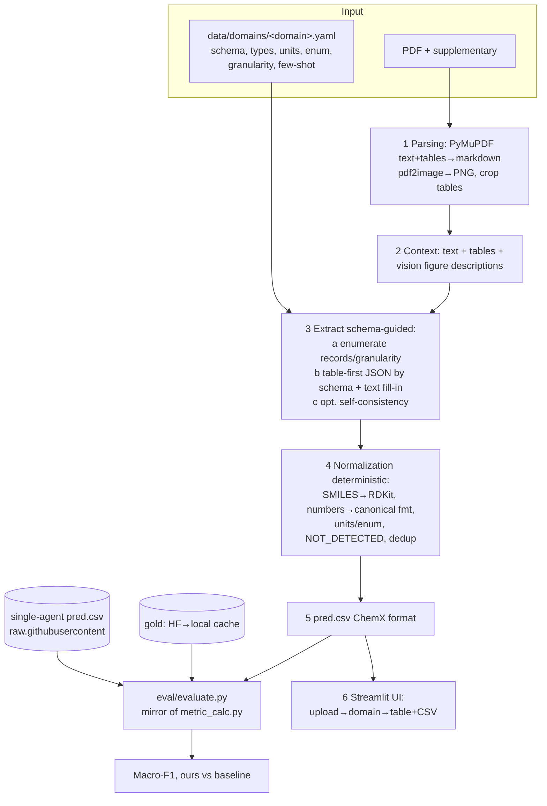

# DataCon'26 — ChemX Extraction System (plan, 1-day build)

## Context

Goal — a system that extracts structured chemical data from scientific PDFs and **beats the
single-agent ChemX baseline** on at least one domain (40 pts) + web UI (20) + code/README quality
(20) + presentation (20). Bonuses: +5 per extra domain (max +40) and +10 for covering both
directions (small molecules + nanomaterials).

The baseline is already vendored in `baseline/` from `ai-chem/ChemX` (`LLM/`): JSON schemas
(`baseline/data/schemas/*.json`), prompts (`baseline/data/prompts/*.py`), columns / eval subsets
(`baseline/src/constants.py`), the reference metric (`baseline/src/metric_calc.py`), and the
published numbers (`baseline/reference_metrics/*.csv`). The `result/` folder (run outputs) was
**not** transferred.

**Decisions from recon:** core domains — **Nanozymes (nano) + Complexes (mol)**; the LLM layer
stays pluggable with Claude as the default (the only provider reachable from here), OpenAI as a
drop-in.

---

## ⚠️ Key constraint: network (measured in this environment)

This remote environment's egress policy is **heavily restricted**. Verified via `curl` through the
proxy:

| Host | Status | Needed for |
|---|---|---|
| `raw.githubusercontent.com` | ✅ 200 | single-agent `pred.csv` (M0 validation) |
| PyPI / npm (`files.pythonhosted.org`) | ✅ 200 | installing dependencies |
| `*.anthropic.com` | ✅ (noProxy) | Claude calls |
| `huggingface.co`, `datasets-server.huggingface.co` | ❌ 403 | **gold tables (every domain)** |
| `api.unpaywall.org`, `api.openalex.org`, Europe PMC (`ebi.ac.uk`) | ❌ blocked | **PDF download (M1)** |
| `api.github.com`, `codeload.github.com` | ❌ 502 | repo tarball |

**Implication:** in this session we can neither load gold from HuggingFace
(`datasets.load_dataset`) nor download PDFs via the resolvers. Execution strategy (pick at
approval/implementation):

- **Recommended — "write code here, run data locally".** This session writes and unit-checks all
  code (Claude + raw.githubusercontent reachable). The actual gold download, PDF fetching, and
  extraction run on a laptop where HF / publishers are open. The plan makes every M1–M5 step
  reproducible with a single local command.
- Alternative A: widen the environment's egress policy (allow `huggingface.co` + resolver/publisher
  hosts) — then everything runs here.
- Alternative B: vendor the data — download gold CSVs and PDFs once locally and place them under
  `data/gold/` + `data/pdfs/` (PDFs gitignored, gold can live in cache). Runtime reads local files
  only.

Design the code to be **independent of how data is accessed**: gold loading and single-agent
predictions go through a layer with an "HF → local CSV cache" fallback.

---

## Architecture (one schema-driven pipeline for all domains)



**Dependency order:** `evaluate.py` (M0) is the foundation — everything is measured by it. Then
PDFs (M1) → parsing (M2) → vertical slice on Nanozymes (M3) → generalize to Complexes (M4) →
UI (M5) → README/presentation (M6).

**Why it beats the baseline:** table-faithful parsing instead of `file_search` chunking (which
shreds tables); vision over tables/figures; **deterministic normalization tuned to the exact
metric**; abstention discipline (`NOT_DETECTED`) on sparse nano columns. A simple core (1 strong
pass + normalization) should already clear the nano bars; self-consistency / table-vision are
optional amplifiers, enabled only if a domain isn't won.

**LLM layer is pluggable:** one interface `llm.complete(messages, images, json_schema)`. Default —
Claude (vision), drop-in OpenAI. Anthropic is reachable from this environment; OpenAI likely isn't.

---

## How the metric works (exact details for the evaluate.py mirror)

From `baseline/src/metric_calc.py` (reproduce 1:1, **do not reinvent**):

1. **`prepare_dataset`**: `load_dataset(DATASETS_IDS[domain])["train"]` → pandas; applies
   `convert_comma` (`,`→`.`) to `NUMERIC_COLUMNS`; `fillna('NOT_DETECTED')`; for
   `oxazolidinone/benzimidazole/cocrystals/complexes` does RDKit canonicalization of `SMILES_COLS`
   (`Chem.MolToSmiles(Chem.MolFromSmiles(x))`, else leave as-is); filters `access == 1`.
2. **`prepare_result(source='single_agent')`**: reads `result/from_single_agent/{domain}/pred.csv`;
   for `cytotoxicity/seltox/synergy/magnetic` appends `.pdf` to the `pdf` column;
   `drop_duplicates()`. Our own pred is the same shape: columns `EXTRACTED_COLUMNS[domain]` + `pdf`.
3. **`calc_metrics`**: per column, comparison as a **multiset of strings within a single article**
   (no row alignment), exact string equality after canonicalization. tp/fp/fn →
   precision/recall/f1. Averaged over df_true columns.
4. **Aggregation in `main`**: F1 summed over articles and divided by the article count; Macro-F1 =
   mean F1 over fields. Both gold and pred lower-case `pdf`.

**Two traps the evaluate.py mirror must handle (repo discrepancies):**
- For `magnetic/seltox` the original calls `np.load(f'src/{dataset}_articles.npy')`, but **those
  `.npy` files are absent**. Their eval subset lives in `constants.py` as `MAGNETIC_ARTICLES` /
  `SELTOX_ARTICLES` (matching what `pdf_extraction.py` uses). → evaluate.py reads the subset **from
  those lists**, no `np.load`. (Not our core domains, but the bridge for bonuses.)
- Gold loads from HF (blocked here). → put gold loading behind `load_gold(domain)`: try
  `datasets.load_dataset`, and on failure read a local cache `data/gold/<domain>.parquet|csv`
  (downloaded once locally). Apply the `prepare_dataset` logic over the loaded df identically.

---

## What we reuse from `baseline/` (do not rewrite)

- `baseline/data/schemas/*.json` — JSON schemas (`{samples: [...]}`) for LLM structured output.
- `baseline/src/constants.py` — `EXTRACTED_COLUMNS`, `NUMERIC_COLUMNS`, `SMILES_COLS`,
  `DATASETS_IDS`, `MAGNETIC_ARTICLES`, `SELTOX_ARTICLES`. Re-export from our `config.py`.
- `baseline/data/prompts/*.py` — starter per-domain prompts (Complexes has per-metal variants
  Ga/Gd/Tc/Lu, see `pdf_extraction.get_query`).
- `baseline/src/metric_calc.py` — metric logic, mirrored into `eval/evaluate.py` with the fixes above.
- `baseline/reference_metrics/*.csv` — ground truth for validating evaluate.py.

---

## Repository structure

```
src/chemx/
  config.py              # load data/domains/*.yaml; re-export baseline/constants.py
  data_access.py         # load_gold(domain): HF→local cache; fetch_single_agent_pred(domain)
                         #   from raw.githubusercontent (reachable: HTTP 200)
  download/fetch_pdfs.py # DOI→PDF: Unpaywall(all oa_locations)→OpenAlex→PMC/EuropePMC→publisher
  parsing/pdf_parse.py   # PyMuPDF text+tables→markdown; pdf2image→PNG; crop table pages
  parsing/figures.py     # vision figure descriptions (<DESCRIPTION_FROM_IMAGE>, stronger than baseline)
  extract/pipeline.py    # enumerate→extract→normalize (orchestration)
  extract/llm.py         # pluggable client: Anthropic (default) / OpenAI; complete(msgs,images,schema)
  extract/prompts.py     # build prompts from domain config + few-shot from gold CSV
  normalize/normalizers.py # SMILES/numbers/units/enum/NOT_DETECTED/dedup
  eval/evaluate.py       # mirror of metric_calc.py (+ fixes: npy→constants, gold via data_access)
data/
  domains/<domain>.yaml  # per-domain config (nanozymes.yaml, complexes.yaml, ...)
  gold/<domain>.parquet  # local gold cache (download once; HF blocked in this environment)
  pdfs/pdf_<domain>/     # downloaded PDFs (gitignored)
  cache/                 # parsed text / vision descriptions (gitignored)
app/streamlit_app.py
results/                 # pred.csv, metrics, comparison table
plan.md  README.md  requirements.txt  Makefile
```

---

## Work order — milestones with go/no-go

**M0. Trusted evaluator — FIRST.** venv; `pandas, datasets, rdkit, pymupdf, pdf2image` (+poppler),
`anthropic`/`openai`, `streamlit`, `pyyaml`. Write `eval/evaluate.py` as a mirror of
`metric_calc.py` with two fixes (npy→`constants` lists; gold via `data_access.load_gold`).
`data_access.fetch_single_agent_pred(domain)` pulls `pred.csv` from
`raw.githubusercontent.com/ai-chem/ChemX/main/LLM/result/from_single_agent/<domain>/pred.csv`
(verified: HTTP 200, ~31 KB for nanozymes).
**Go/no-go:** evaluate.py on single-agent pred yields numbers matching
`baseline/reference_metrics/metrics_<domain>_from_single_agent.csv`. Requires a local gold cache
(download from HF locally — HF is blocked here). Until it matches, we don't understand the metric;
do not proceed.

**M1. PDF acquisition (run where resolvers are open).** `fetch_pdfs.py`: from gold (`access==1`;
for magnetic/seltox — lists from constants) collect DOI + file name; chain
Unpaywall(all `oa_locations`)→OpenAlex(`locations[].pdf_url`,`ids.pmcid`)→Europe PMC/PMC→publisher
patterns (MDPI/RSC/Elsevier). Save under the exact dataset file names (names are the join key to
gold's `pdf` column). **Check:** eval-set coverage for the target domain; fetch the "tail" manually.
Noted: `access==1` ≠ auto-downloadable (Nanozymes ~26/39 auto-available).

**M2. Parsing.** `pdf_parse.py`: PyMuPDF→markdown(text+tables), pdf2image→PNG, crop table pages;
`figures.py`→vision descriptions. **Check:** on 1 article, tables and captions are visible in the
assembled context; results cached in `data/cache/`.

**M3. Vertical slice on the nano anchor (Nanozymes) — locks ≥40 pts.** `nanozymes.yaml` (schema
from `baseline/data/schemas/nanozymes.json`, 20 fields, few-shot from real gold rows);
pipeline enumerate→extract→normalize; run over all downloaded articles → pred.csv → evaluate.
**Go/no-go: iterate normalization/abstention/granularity until Macro-F1 > 0.164.**

**M4. Generalize + molecules (both directions → +10).** `complexes.yaml` (mol, SMILES; per-metal
prompts as in baseline). RDKit canonicalization gives us SMILES matches "for free." Target Macro-F1
> 0.290. Then, time permitting — stretch domains (+5 each): Co-crystals, Synergy/Nanomag/SelTox =
config + download + run.

**M5. Web UI (Streamlit).** Upload PDF → select domain → run pipeline → table + download CSV;
field-source tag (text/table/figure). Minimal but clean.

**M6. README, reproducibility, presentation.** README with one-command run (Makefile), pinned
dependencies, final Macro-F1 table (ours vs baseline per domain/field), short explanation of the
architecture and the metric for the judges.

---

## Verification (how we confirm it works)

- **Metric is correct:** `evaluate.py` on single-agent `pred.csv` reproduces
  `baseline/reference_metrics/*.csv` (Macro-F1 and per-field F1 match for the target domains).
- **Beats baseline:** `results/metrics_nanozymes.csv` Macro-F1 > 0.164 and
  `results/metrics_complexes.csv` Macro-F1 > 0.290; print a per-field comparison table.
- **Both directions:** a win on ≥1 nano (Nanozymes) + ≥1 mol (Complexes).
- **Web UI:** uploading a test PDF → correct table + valid ChemX-format CSV.
- **Reproducibility:** clean clone → `pip install -r requirements.txt` → M0–M5 commands run
  end-to-end on one domain (where the network is open for data).

---

## Risks and mitigation

| Risk | Mitigation |
|---|---|
| **Egress blocks HF + resolvers** (this session) | Code is access-method agnostic: `data_access` (HF→local cache), single-agent pred from raw.githubusercontent; data is run locally / after a policy change |
| **Some OA PDFs won't download** (~33% on Nanozymes) | Resolver chain + publisher patterns; manual "tail" fetch; honestly record eval-set coverage |
| Missing eval-subset `.npy` (magnetic/seltox) | evaluate.py reads the subset from `MAGNETIC_ARTICLES`/`SELTOX_ARTICLES` in `constants.py` |
| Small domains (Complexes 3–4 articles) → F1 variance | Nano anchor Nanozymes (39 articles) as the guarantee; Complexes for the bonus direction |
| Exact string format of values | Calibrate normalizers against real gold CSVs + single-agent pred; few-shot with real rows |
| LLM cost/time | Simple core (1 pass) first; cache parsing; amplifiers only when a bar isn't met |
| LLM choice deferred | `llm.py` is abstract; default Claude (reachable here), OpenAI drop-in |

